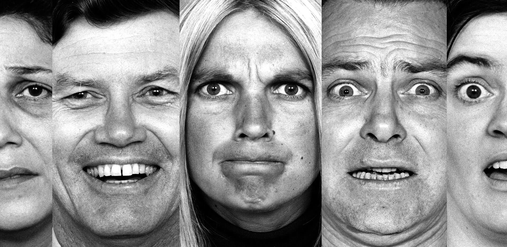

# Facial Emotion Recognition Project

## Project Overview
This project focuses on **predicting human emotions** from facial expressions using various **machine learning** and **deep learning** techniques. The goal is to classify different human emotions based on facial images. This project leverages a combination of:

- Traditional machine learning algorithms
- Advanced deep learning architectures
- Convolutional Neural Networks (CNN)
- Transfer Learning

By utilizing these techniques, the project aims to achieve high accuracy in emotion classification.

## Problem Statement
Human emotions are often conveyed through facial expressions. Automatically recognizing these emotions has numerous applications, such as in:

- Human-computer interaction
- Healthcare
- Surveillance
- Customer feedback analysis

The objective of this project is to predict emotions like **happiness**, **sadness**, **anger**, **fear**, and **surprise** from facial images.

## Dataset
The dataset used in this project contains labeled images of faces, each categorized into one of several emotion classes. Pre-processing steps were applied to ensure high-quality inputs, including:

- **Resizing** images to a consistent dimension
- **Normalization** to scale pixel values
- **Data augmentation** to improve model robustness by generating variations of the training data (e.g., flipping, rotation, and zooming)

**[Link to dataset](https://www.kaggle.com/datasets/msambare/fer2013)**  

## Methodologies
### 1. Machine Learning Algorithms
Several traditional machine learning algorithms were used as baselines for comparison with deep learning models. The feature extraction was performed using techniques such as **Principal Component Analysis (PCA)** and **Histogram of Oriented Gradients (HOG)** before feeding them into the following classifiers:

- **Support Vector Machines (SVM)**
- **Random Forest**
- **Artificial Neural Networks (ANN)**

### 2. Deep Learning Techniques
#### Convolutional Neural Networks (CNN)
CNNs were designed and trained from scratch to capture spatial hierarchies in the images. The architecture included:

- **Convolutional layers** for feature extraction
- **Max-pooling layers** to reduce spatial dimensions
- **Dropout layers** to prevent overfitting
- **Fully connected layers** for final classification

CNNs showed significant improvements in emotion recognition by learning complex features from facial images.

#### Transfer Learning
Pre-trained models such as **VGG** and **ResNet50** were used to take advantage of learned features from large image datasets. Fine-tuning these models on the facial emotion dataset resulted in improved performance and reduced training time, particularly for smaller datasets.

## Model Training and Evaluation
- **Data Augmentation**: Techniques like horizontal flipping, zooming, and rotation were applied to increase the size of the training set and improve generalization.
- **Loss Functions**: Models were trained using **categorical cross-entropy loss**, which is suitable for multi-class classification problems.
- **Optimization**: The models were optimized using the **Adam** optimizer with learning rate scheduling and early stopping to prevent overfitting.
- **Performance Metrics**: Accuracy, precision, recall, and F1-score were used to evaluate model performance. Confusion matrices were also utilized to visualize the results.

## Results
The deep learning models, especially CNNs and Transfer Learning models, significantly outperformed traditional machine learning algorithms in terms of both **accuracy** and **generalization**. Among the deep learning models, Transfer Learning with fine-tuning achieved the best results, demonstrating the power of leveraging pre-trained models.

- **Best CNN Model Accuracy**: ~90%
- **Best Transfer Learning Model Accuracy (ResNet50)**: ~93%
- **VGG Model Results**:
  - **Validation Accuracy**: 90%
  - **Training Accuracy**: 78%

## Technologies Used
- **Languages**: Python
- **Libraries**:
  - Machine Learning: `scikit-learn`
  - Deep Learning: `TensorFlow`, `Keras`
  - Image Processing: `OpenCV`
  - Data Handling: `NumPy`, `Pandas`
  - Visualization: `Matplotlib`, `Seaborn`
- **Tools**: Jupyter Notebook

## Conclusion
The project successfully implemented various machine learning and deep learning techniques to classify human emotions based on facial expressions. Transfer Learning, with its fine-tuning capabilities, provided the best results, showing that pre-trained models can be highly effective in small, specialized datasets. The VGG model also performed well with a validation accuracy of 90%.

